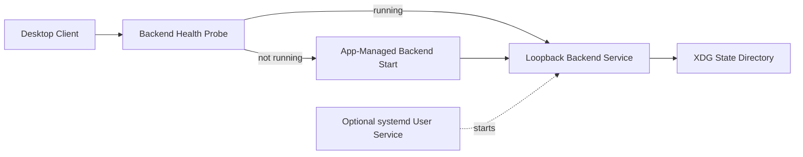

# Deployment Architecture - Unit 1 Backend Foundation and Local API

## Architecture Summary

## Text Alternative
- Desktop client probes backend health first.
- If the backend is not running, the client starts it directly.
- If the backend is already running, the client connects to it over loopback.
- The backend reads and writes canonical state in the XDG state directory.
- An optional systemd user-service path may start the same backend outside the app-managed flow.

## Environment Modes

### Development Mode
- Separate backend and client processes.
- Loopback HTTP communication.
- Local state persisted with Linux-friendly conventions rather than ad hoc temp-only behavior.

### Packaged Runtime Mode
- Desktop client remains the primary launcher experience.
- Backend may be spawned by the app or already managed as an optional user service.
- Backend behavior and API contract remain the same across packaging formats.

## Deployment Constraints
- No remote-access mode in Unit 1.
- No cloud dependencies in Unit 1.
- No infrastructure that assumes multi-user or multi-host deployment.

## Readiness and Failure Flow
- Startup waits for readiness within the approved target window.
- Failure to become ready is surfaced back to the client in a structured way.
- Recovery is explicit and user-initiated rather than self-healing by background restart loops.