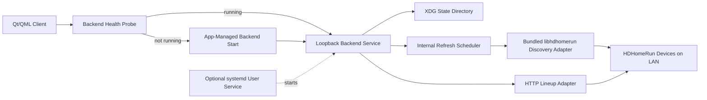

# Deployment Architecture - Unit 2 HDHomeRun Discovery and Device Integration

## Architecture Summary

## Text Alternative
- The Qt/QML client probes backend health first.
- If the backend is not running, the client starts it directly.
- The backend owns all LAN-facing HDHomeRun behavior.
- An internal refresh scheduler in the backend performs startup discovery and periodic lightweight refresh.
- Discovery uses the bundled `libhdhomerun` integration path.
- Lineup retrieval uses device HTTP endpoints from the backend.
- The backend persists canonical remembered context in the XDG state directory.
- An optional systemd user-service path may start the same backend, but it does not change refresh ownership or API semantics.

## Environment Modes

### Development Mode
- Separate backend and client processes.
- Same bundled native-library integration path intended for packaged builds.
- Loopback HTTP between client and backend.
- Real LAN device discovery and lineup retrieval where practical.
- Stale lineup fallback retained only in backend process memory.

### Packaged Runtime Mode
- Desktop client remains the primary launcher experience.
- Backend may be app-spawned or already running as an optional user service.
- Packaged outputs include the backend plus bundled `libhdhomerun` integration.
- AppImage, Flatpak, and Debian variants are expected to preserve outbound LAN access needed for discovery and lineup retrieval.
- The loopback API contract remains the same across packaging formats.

## Deployment Constraints
- No remote inbound backend mode in Unit 2.
- No client-owned LAN polling loop.
- No requirement for a separately installed system `libhdhomerun` in v1.
- No disk-persisted stale lineup cache in Unit 2.

## Refresh and Failure Flow
- Backend startup triggers initial discovery.
- If a device is selected, backend loads lineup data and maintains the in-memory latest-successful snapshot.
- Scheduled refresh updates discovery state and may refresh lineup data.
- If lineup refresh fails, the backend may keep the last successful lineup snapshot but must mark it stale.
- If discovery no longer finds the remembered or selected device, the backend transitions to the selection-needed behavior defined in Unit 2 functional design.