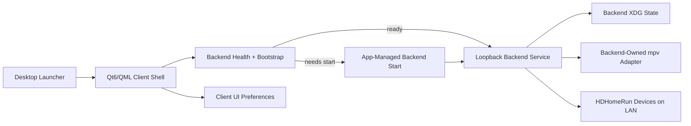

# Deployment Architecture - Unit 4 Qt/QML Client Shell and Live-TV User Journey

## Architecture Summary

## Text Alternative
- The user starts the desktop launcher.
- The Qt6 client becomes visible immediately and coordinates backend readiness.
- If needed, the client starts or waits for the loopback backend.
- The backend remains the only component talking to HDHomeRun devices and the playback adapter.
- The client stores only presentation preferences locally.
- Backend-owned canonical state and playback orchestration remain separate from client preferences.

## Environment Modes

### Development Mode
- Client and backend run as separate processes.
- Loopback HTTP remains the only client-backend communication path.
- The same backend-owned `mpv` assumptions apply as in packaged runtime.

### Packaged Runtime Mode
- One desktop entry launches the client-first experience.
- Client and backend remain distinct processes even when bundled together.
- AppImage, Flatpak, and Debian outputs must all preserve loopback communication and the agreed `mpv` delivery strategy.

## Deployment Constraints
- No client-owned direct LAN polling.
- No direct client control of `mpv`.
- No remote inbound service behavior.
- No merging of client-only preferences with backend canonical state.