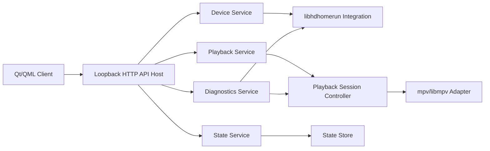

# Component Dependency

## Dependency Matrix

| Component | Depends On | Relationship |
|---|---|---|
| Desktop Client Shell | Service Launcher and Supervisor, Client Gateway Service | startup and API consumption |
| Channel Browser Component | Client Gateway Service | device and channel data retrieval |
| Embedded Player Component | Client Gateway Service, Playback Engine Adapter | playback session display |
| Diagnostics Panel Component | Client Gateway Service | diagnostics display |
| Backend API Host | Device Service, Playback Service, Diagnostics Service, State Service | request routing |
| Device Service | Device Integration Component, State Service | device discovery and active device context |
| Playback Service | Device Integration Component, Playback Session Controller, State Service | playback orchestration |
| Playback Session Controller | Playback Engine Adapter, State Service | persistent session control |
| Diagnostics Service | Device Integration Component, Playback Session Controller | tuner and signal visibility |
| State Service | State Store | canonical persistence |

## Communication Patterns
- **Client to Backend**: loopback HTTP/JSON only in v1.
- **Backend Internal**: direct in-process service calls.
- **Playback Control**: internal adapter boundary between backend orchestration and mpv/libmpv.
- **Startup Control**: local process-management path that supports both auto-start and managed-service modes.

## Data Flow

## Text Alternative
- Qt/QML client talks only to the loopback HTTP API host.
- API host routes requests to backend services.
- Device service uses libhdhomerun integration.
- Playback service uses a playback session controller, which then uses an mpv or libmpv adapter.
- State service persists remembered device and channel state.
- Diagnostics service combines device data and playback-session context.

## Coupling Guidance
- UI must not call libhdhomerun directly.
- Playback engine specifics must stay behind the playback adapter.
- Canonical restore state must remain backend-owned.
- Client-facing API should stay narrow so alternate clients can reuse it later.