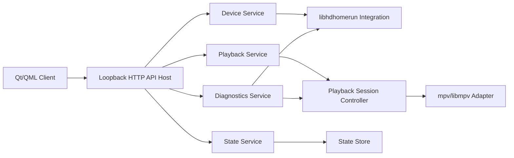
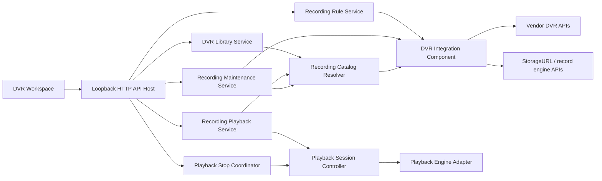

# Component Dependency

## Dependency Matrix

| Component | Depends On | Relationship |
|---|---|---|
| Desktop Client Shell | Service Launcher and Supervisor, Client Gateway Service | startup and API consumption |
| Channel Browser Component | Client Gateway Service | device and channel data retrieval |
| Embedded Player Component | Client Gateway Service, Playback Engine Adapter | playback session display |
| Diagnostics Panel Component | Client Gateway Service | diagnostics display |
| Backend API Host | Device Service, Playback Service, Diagnostics Service, State Service | request routing |
| Device Service | Device Integration Component, State Service | device discovery and active device context |
| Playback Service | Device Integration Component, Playback Session Controller, State Service | playback orchestration |
| Playback Session Controller | Playback Engine Adapter, State Service | persistent session control |
| Diagnostics Service | Device Integration Component, Playback Session Controller | tuner and signal visibility |
| State Service | State Store | canonical persistence |

## Communication Patterns
- **Client to Backend**: loopback HTTP/JSON only in v1.
- **Backend Internal**: direct in-process service calls.
- **Playback Control**: internal adapter boundary between backend orchestration and mpv/libmpv.
- **Startup Control**: local process-management path that supports both auto-start and managed-service modes.

## Data Flow

## Text Alternative
- Qt/QML client talks only to the loopback HTTP API host.
- API host routes requests to backend services.
- Device service uses libhdhomerun integration.
- Playback service uses a playback session controller, which then uses an mpv or libmpv adapter.
- State service persists remembered device and channel state.
- Diagnostics service combines device data and playback-session context.

## Coupling Guidance
- UI must not call libhdhomerun directly.
- Playback engine specifics must stay behind the playback adapter.
- Canonical restore state must remain backend-owned.
- Client-facing API should stay narrow so alternate clients can reuse it later.

## DVR Increment Dependency Matrix

| Component | Depends On | Relationship |
|---|---|---|
| DVR Workspace Component | Client Gateway Service, Playback Service | DVR home retrieval and playback actions |
| Recording Rule Editor Component | Client Gateway Service | rule creation and editing through backend-owned APIs |
| DVR Library Service | DVR Integration Component, Recording Catalog Resolver, State Service | readiness computation and merged catalog assembly |
| Recording Rule Service | DVR Integration Component | vendor-side rule management and rule projection |
| Recording Playback Service | Recording Catalog Resolver, Playback Session Controller | recorded-file playback resolution and session handoff |
| Recording Maintenance Service | Recording Catalog Resolver, DVR Integration Component | delete target validation and post-delete refresh |
| Playback Stop Coordinator | Playback Engine Adapter, State Service | explicit stop lifecycle for live playback |
| DVR Integration Component | discovered storage engines, vendor DVR APIs | upstream DVR metadata and storage interaction |
| Recording Catalog Resolver | DVR Integration Component | local-first source ordering and catalog normalization |

## DVR Communication Patterns
- **Client to Backend**: the client uses dedicated DVR endpoints for readiness, library, rules, upcoming state, and maintenance actions.
- **Backend Internal**: DVR services call the integration and catalog components directly in-process.
- **Playback Reuse**: recorded playback reuses the existing playback session controller rather than introducing a parallel player stack.
- **Stop Control**: explicit Live TV stop flows through the playback-session boundary, not through direct UI control of the engine adapter.

## DVR Data Flow

## DVR Text Alternative
- The DVR workspace talks only to the loopback API host.
- The API host fans out to library, rule, playback, maintenance, and stop services.
- Library and maintenance behavior rely on a catalog resolver that orders local storage ahead of non-local storage.
- Rule operations and storage interactions go through the DVR integration component.
- Recorded playback and explicit Live TV stop both reuse the existing playback session controller.