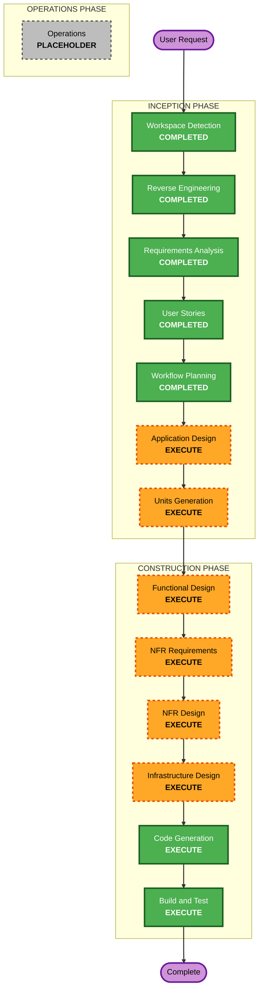

# Execution Plan

## Detailed Analysis Summary

### Transformation Scope
- **Transformation Type**: Architectural feature extension in an existing brownfield application.
- **Primary Changes**:
  - add backend-owned DVR domain and API capabilities
  - integrate local storage-engine and vendor-side DVR APIs
  - extend the Qt client with a dedicated DVR tab and recorded-content workflows
  - add explicit Live TV stop-session behavior
- **Related Components**:
  - `backend/`
  - `client/`
  - existing guide and playback flows
  - packaging and runtime verification paths if new DVR behavior affects packaged execution

### Change Impact Assessment
- **User-facing changes**: Yes. New DVR tab, recorded-library workflows, rule management, status cues, readiness states, and Live TV stop behavior.
- **Structural changes**: Yes. New DVR service boundaries, new backend contracts, and new client navigation and state projection.
- **Data model changes**: Yes. Recording rules, recorded items, storage sources, DVR readiness, and scheduled or recorded state projections.
- **API changes**: Yes. New loopback endpoints and contract types will be needed for recordings, rules, readiness, and related actions.
- **NFR impact**: Yes. Security, testability, error handling, and runtime behavior are all affected.

### Component Relationships
- **Primary Components**:
  - backend DVR integration and contract layer
  - client DVR tab and playback workflows
- **Infrastructure Components**:
  - packaging verification flows and runtime launch behavior
- **Shared Components**:
  - existing backend models, playback orchestration, and guide integration
- **Dependent Components**:
  - client controller and QML views that consume backend DVR endpoints
- **Supporting Components**:
  - backend tests, client smoke coverage, and package validation paths

### Risk Assessment
- **Risk Level**: High
- **Rollback Complexity**: Moderate
- **Testing Complexity**: Complex
- **Key Risks**:
  - vendor rule APIs and local storage-engine APIs must be unified coherently
  - recorded playback must coexist safely with existing live-playback architecture
  - DVR readiness and missing-prerequisite states must be clear and testable
  - delete and control actions increase safety and validation expectations

## Workflow Visualization

## Text Alternative
- Workspace Detection: completed
- Reverse Engineering: completed
- Requirements Analysis: completed
- User Stories: completed
- Workflow Planning: completed
- Application Design: execute
- Units Generation: execute
- Functional Design: execute
- NFR Requirements: execute
- NFR Design: execute
- Infrastructure Design: execute
- Code Generation: execute
- Build and Test: execute

## Phases to Execute

### INCEPTION PHASE
- [x] Workspace Detection
- [x] Reverse Engineering
- [x] Requirements Analysis
- [x] User Stories
- [x] Workflow Planning
- [ ] Application Design - EXECUTE
  - **Rationale**: DVR adds new backend services, client surfaces, state flows, and component interactions that are not fully defined in the existing Live TV design.
- [ ] Units Generation - EXECUTE
  - **Rationale**: The DVR increment spans multiple packages and should be decomposed into explicit implementation units rather than improvised as one large change.

### CONSTRUCTION PHASE
- [ ] Functional Design - EXECUTE
  - **Rationale**: New DVR entities, rule behaviors, readiness states, and library workflows need detailed behavior modeling.
- [ ] NFR Requirements - EXECUTE
  - **Rationale**: DVR adds safety, validation, runtime, and testing expectations beyond the current Live TV path.
- [ ] NFR Design - EXECUTE
  - **Rationale**: The feature needs explicit patterns for validation, storage-source prioritization, error isolation, and projection of mixed vendor and local state.
- [ ] Infrastructure Design - EXECUTE
  - **Rationale**: DVR integration still uses local-network and packaged-runtime behavior that should be mapped explicitly, even if no cloud infrastructure is involved.
- [ ] Code Generation - EXECUTE
  - **Rationale**: Implementation planning and code changes are required.
- [ ] Build and Test - EXECUTE
  - **Rationale**: End-to-end validation is required across backend, client, and packaged runtime behavior.

### OPERATIONS PHASE
- [ ] Operations - PLACEHOLDER
  - **Rationale**: No separate operations workflow exists yet.

## Module Update Strategy
- **Update Approach**: Hybrid
- **Critical Path**:
  1. Backend DVR domain and loopback contract definitions
  2. Storage-engine and vendor-rule integration
  3. Recorded playback and Live TV stop-session control
  4. Client DVR tab and user workflows
  5. Build, test, and runtime verification
- **Coordination Points**:
  - shared backend models between recordings, rules, readiness, and playback
  - reuse of existing guide and playback orchestration boundaries
  - client controller and QML updates for new DVR surfaces
  - package verification for any new runtime assumptions
- **Testing Checkpoints**:
  - backend contract tests after each new DVR endpoint cluster
  - client integration checks after DVR tab and playback flows are wired
  - integrated verification for recording readiness, deletion, and Live TV stop behavior

## Recommended Next Units
- **Unit A**: DVR backend domain and readiness APIs
- **Unit B**: Recorded library, recorded playback, and deletion flows
- **Unit C**: Recording-rule creation, update, and scheduling-state projection
- **Unit D**: Client DVR tab and Live TV stop-control UX
- **Unit E**: Build, test, and packaged-runtime verification

## Success Criteria
- Approved design and unit breakdown for the DVR increment
- Backend and client responsibilities are explicit before coding begins
- The implementation sequence preserves the approved library-first emphasis while still delivering rule creation in the first meaningful increment
- The final solution remains consistent with the existing Linux player architecture and security posture# Execution Plan

## Detailed Analysis Summary

### Transformation Scope
- **Transformation Type**: New application layered onto an existing vendor-code workspace
- **Primary Changes**:
  - add a reusable local backend service
  - add a Qt/QML desktop client
  - add playback integration around mpv or libmpv
  - add Linux packaging outputs for AppImage, Flatpak, and Debian
- **Related Components**:
  - `hdhomerun-linux` will host the new application code
  - `libhdhomerun` will be reused as the device integration boundary
  - packaging assets and local runtime integration will be introduced as new project components

### Change Impact Assessment
- **User-facing changes**: Yes. The entire deliverable is a new end-user Linux TV product.
- **Structural changes**: Yes. A new multi-component application structure will be created.
- **Data model changes**: Yes, at least for local app state such as remembered device and last watched channel.
- **API changes**: Yes. A local service API will be defined between backend and desktop client.
- **NFR impact**: Yes. Playback reliability, local-service security, packaging, and maintainability strongly influence design.

### Component Relationships
- **Primary Component**: New bundled application in `hdhomerun-linux`
- **Vendor Integration Component**: `libhdhomerun`
- **Playback Component**: mpv or libmpv integration layer
- **Packaging Components**: AppImage, Flatpak, and Debian build outputs

### Risk Assessment
- **Risk Level**: High
- **Rollback Complexity**: Moderate
- **Testing Complexity**: Complex

## Module Update Strategy
- **Update Approach**: Hybrid
- **Critical Path**:
  - choose runtime architecture and local IPC boundary
  - implement backend service skeleton
  - implement client shell and playback embedding
  - add packaging outputs after the runnable app path exists
- **Coordination Points**:
  - backend to client API contract
  - backend to libhdhomerun integration contract
  - client to playback engine integration contract
  - packaging expectations across three Linux output formats
- **Testing Checkpoints**:
  - backend discovery and lineup tests
  - playback session switching validation
  - end-to-end local run against a real device
  - packaging smoke tests for each output format

## Workflow Visualization

## Text Alternative
- Workspace Detection: completed
- Reverse Engineering: completed
- Requirements Analysis: completed
- User Stories: completed
- Workflow Planning: completed and awaiting approval
- Application Design: execute
- Units Generation: execute
- Functional Design: execute
- NFR Requirements: execute
- NFR Design: execute
- Infrastructure Design: execute
- Code Generation: execute
- Build and Test: execute

## Phases to Execute

### INCEPTION PHASE
- [x] Workspace Detection
- [x] Reverse Engineering
- [x] Requirements Analysis
- [x] User Stories
- [x] Workflow Planning
- [ ] Application Design - EXECUTE
  - **Rationale**: New backend-service, client, playback, and packaging boundaries need explicit component design.
- [ ] Units Generation - EXECUTE
  - **Rationale**: Work spans multiple logical units that should be planned before coding.

### CONSTRUCTION PHASE
- [ ] Functional Design - EXECUTE
  - **Rationale**: Discovery, playback-session orchestration, and channel switching have business behavior that should be designed.
- [ ] NFR Requirements - EXECUTE
  - **Rationale**: Reliability, security, and packaging are central requirements, not afterthoughts.
- [ ] NFR Design - EXECUTE
  - **Rationale**: The implementation needs explicit patterns for local service exposure, state handling, and playback resilience.
- [ ] Infrastructure Design - EXECUTE
  - **Rationale**: Local service process model, packaging layout, and deployment artifacts need concrete design.
- [ ] Code Generation - EXECUTE
  - **Rationale**: Implementation is required.
- [ ] Build and Test - EXECUTE
  - **Rationale**: Live-device validation and packaging smoke tests are required.

## Recommended Initial Unit Breakdown
1. Backend service foundation and local API contract
2. HDHomeRun discovery and lineup integration
3. Playback session controller and mpv integration
4. Qt/QML desktop shell and live-TV user journey
5. Linux packaging and installation artifacts

## Recommendation

Proceed with full application design and unit generation rather than jumping straight into coding. The chosen product shape introduces enough architectural surface area that a short, explicit design pass will reduce rework, especially around local API boundaries, embedded playback, and multi-format packaging.