# Execution Plan

## Detailed Analysis Summary

### Transformation Scope
- **Transformation Type**: New application layered onto an existing vendor-code workspace
- **Primary Changes**:
  - add a reusable local backend service
  - add a Qt/QML desktop client
  - add playback integration around mpv or libmpv
  - add Linux packaging outputs for AppImage, Flatpak, and Debian
- **Related Components**:
  - `hdhomerun-linux` will host the new application code
  - `libhdhomerun` will be reused as the device integration boundary
  - packaging assets and local runtime integration will be introduced as new project components

### Change Impact Assessment
- **User-facing changes**: Yes. The entire deliverable is a new end-user Linux TV product.
- **Structural changes**: Yes. A new multi-component application structure will be created.
- **Data model changes**: Yes, at least for local app state such as remembered device and last watched channel.
- **API changes**: Yes. A local service API will be defined between backend and desktop client.
- **NFR impact**: Yes. Playback reliability, local-service security, packaging, and maintainability strongly influence design.

### Component Relationships
- **Primary Component**: New bundled application in `hdhomerun-linux`
- **Vendor Integration Component**: `libhdhomerun`
- **Playback Component**: mpv or libmpv integration layer
- **Packaging Components**: AppImage, Flatpak, and Debian build outputs

### Risk Assessment
- **Risk Level**: High
- **Rollback Complexity**: Moderate
- **Testing Complexity**: Complex

## Module Update Strategy
- **Update Approach**: Hybrid
- **Critical Path**:
  - choose runtime architecture and local IPC boundary
  - implement backend service skeleton
  - implement client shell and playback embedding
  - add packaging outputs after the runnable app path exists
- **Coordination Points**:
  - backend to client API contract
  - backend to libhdhomerun integration contract
  - client to playback engine integration contract
  - packaging expectations across three Linux output formats
- **Testing Checkpoints**:
  - backend discovery and lineup tests
  - playback session switching validation
  - end-to-end local run against a real device
  - packaging smoke tests for each output format

## Workflow Visualization

```mermaid
flowchart TD
    Start(["User Request"])

    subgraph INCEPTION["INCEPTION PHASE"]
        WD["Workspace Detection\nCOMPLETED"]
        RE["Reverse Engineering\nCOMPLETED"]
        RA["Requirements Analysis\nCOMPLETED"]
        US["User Stories\nCOMPLETED"]
        WP["Workflow Planning\nCOMPLETED"]
        AD["Application Design\nEXECUTE"]
        UG["Units Generation\nEXECUTE"]
    end

    subgraph CONSTRUCTION["CONSTRUCTION PHASE"]
        FD["Functional Design\nEXECUTE"]
        NFRA["NFR Requirements\nEXECUTE"]
        NFRD["NFR Design\nEXECUTE"]
        ID["Infrastructure Design\nEXECUTE"]
        CG["Code Generation\nEXECUTE"]
        BT["Build and Test\nEXECUTE"]
    end

    Start --> WD
    WD --> RE
    RE --> RA
    RA --> US
    US --> WP
    WP --> AD
    AD --> UG
    UG --> FD
    FD --> NFRA
    NFRA --> NFRD
    NFRD --> ID
    ID --> CG
    CG --> BT

    style WD fill:#4CAF50,stroke:#1B5E20,stroke-width:3px,color:#fff
    style RE fill:#4CAF50,stroke:#1B5E20,stroke-width:3px,color:#fff
    style RA fill:#4CAF50,stroke:#1B5E20,stroke-width:3px,color:#fff
    style US fill:#4CAF50,stroke:#1B5E20,stroke-width:3px,color:#fff
    style WP fill:#4CAF50,stroke:#1B5E20,stroke-width:3px,color:#fff
    style AD fill:#FFA726,stroke:#E65100,stroke-width:3px,stroke-dasharray: 5 5,color:#000
    style UG fill:#FFA726,stroke:#E65100,stroke-width:3px,stroke-dasharray: 5 5,color:#000
    style FD fill:#FFA726,stroke:#E65100,stroke-width:3px,stroke-dasharray: 5 5,color:#000
    style NFRA fill:#FFA726,stroke:#E65100,stroke-width:3px,stroke-dasharray: 5 5,color:#000
    style NFRD fill:#FFA726,stroke:#E65100,stroke-width:3px,stroke-dasharray: 5 5,color:#000
    style ID fill:#FFA726,stroke:#E65100,stroke-width:3px,stroke-dasharray: 5 5,color:#000
    style CG fill:#4CAF50,stroke:#1B5E20,stroke-width:3px,color:#fff
    style BT fill:#4CAF50,stroke:#1B5E20,stroke-width:3px,color:#fff
    style Start fill:#CE93D8,stroke:#6A1B9A,stroke-width:3px,color:#000

    linkStyle default stroke:#333,stroke-width:2px
```

## Text Alternative
- Workspace Detection: completed
- Reverse Engineering: completed
- Requirements Analysis: completed
- User Stories: completed
- Workflow Planning: completed and awaiting approval
- Application Design: execute
- Units Generation: execute
- Functional Design: execute
- NFR Requirements: execute
- NFR Design: execute
- Infrastructure Design: execute
- Code Generation: execute
- Build and Test: execute

## Phases to Execute

### INCEPTION PHASE
- [x] Workspace Detection
- [x] Reverse Engineering
- [x] Requirements Analysis
- [x] User Stories
- [x] Workflow Planning
- [ ] Application Design - EXECUTE
  - **Rationale**: New backend-service, client, playback, and packaging boundaries need explicit component design.
- [ ] Units Generation - EXECUTE
  - **Rationale**: Work spans multiple logical units that should be planned before coding.

### CONSTRUCTION PHASE
- [ ] Functional Design - EXECUTE
  - **Rationale**: Discovery, playback-session orchestration, and channel switching have business behavior that should be designed.
- [ ] NFR Requirements - EXECUTE
  - **Rationale**: Reliability, security, and packaging are central requirements, not afterthoughts.
- [ ] NFR Design - EXECUTE
  - **Rationale**: The implementation needs explicit patterns for local service exposure, state handling, and playback resilience.
- [ ] Infrastructure Design - EXECUTE
  - **Rationale**: Local service process model, packaging layout, and deployment artifacts need concrete design.
- [ ] Code Generation - EXECUTE
  - **Rationale**: Implementation is required.
- [ ] Build and Test - EXECUTE
  - **Rationale**: Live-device validation and packaging smoke tests are required.

## Recommended Initial Unit Breakdown
1. Backend service foundation and local API contract
2. HDHomeRun discovery and lineup integration
3. Playback session controller and mpv integration
4. Qt/QML desktop shell and live-TV user journey
5. Linux packaging and installation artifacts

## Recommendation

Proceed with full application design and unit generation rather than jumping straight into coding. The chosen product shape introduces enough architectural surface area that a short, explicit design pass will reduce rework, especially around local API boundaries, embedded playback, and multi-format packaging.