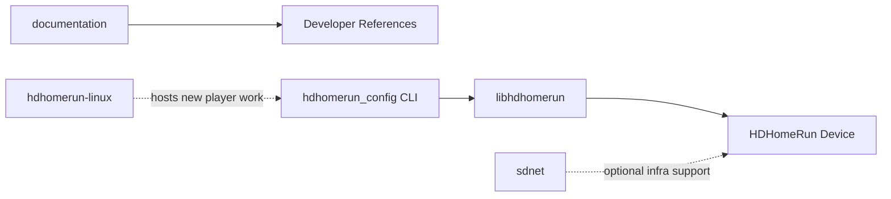
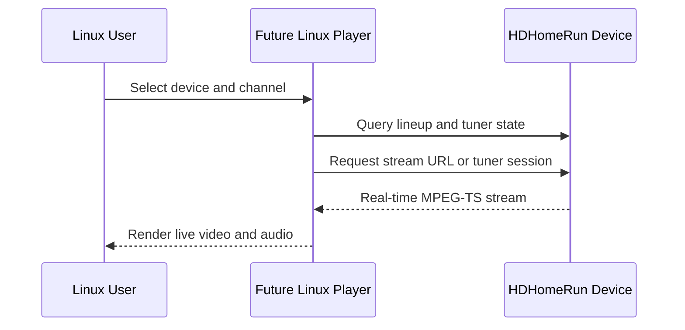

# System Architecture

## System Overview

The current workspace is not an end-user application. It is a collection of vendor libraries and references. The most relevant runtime path is `hdhomerun_config` on top of `libhdhomerun`, which communicates with the HDHomeRun device over the local network. A Linux player must add a new presentation and playback layer above these capabilities.

## Architecture Diagram

## Text Alternative

- `documentation` points to SiliconDust references.
- `hdhomerun_config` is the only current executable application surface.
- `hdhomerun_config` is built directly on `libhdhomerun`.
- `libhdhomerun` talks to the HDHomeRun device.
- `sdnet` is a reusable support library but is not currently wired into a Linux TV player.
- `hdhomerun-linux` is the intended landing zone for the new Linux player project.

## Component Descriptions

### documentation
- **Purpose**: Lightweight developer documentation entry point.
- **Responsibilities**: Route developers to the SiliconDust wiki.
- **Dependencies**: External documentation only.
- **Type**: Documentation.

### libhdhomerun
- **Purpose**: Core device discovery, control, scan, and stream transport library.
- **Responsibilities**: Manage device objects, tuner state, channel maps, channel scans, and streaming sockets.
- **Dependencies**: POSIX sockets, pthreads, Linux `librt` on Linux.
- **Type**: Shared library and CLI dependency.

### hdhomerun_config
- **Purpose**: Command-line utility for discovery, query, configuration, scanning, and stream saving.
- **Responsibilities**: Human-accessible entry point to libhdhomerun operations.
- **Dependencies**: `libhdhomerun` sources.
- **Type**: Application.

### sdnet
- **Purpose**: Cross-platform systems library with web, networking, crypto, and OS primitives.
- **Responsibilities**: Provide lower-level reusable components for networking and service layers.
- **Dependencies**: Platform-specific OS integrations across Linux, BSD, macOS, and Windows.
- **Type**: Shared infrastructure library.

### hdhomerun-linux
- **Purpose**: New-product host repository.
- **Responsibilities**: Store AI-DLC artifacts now and the Linux player implementation next.
- **Dependencies**: None yet.
- **Type**: Project container.

## Data Flow

## Text Alternative

1. The user chooses a device and channel.
2. The player queries the device for metadata and tuner availability.
3. The player requests a stream from the device.
4. The device returns a live MPEG-TS stream.
5. The player decodes and renders the stream for the user.

## Integration Points
- **HDHomeRun Control Protocol**: Exposed via `libhdhomerun` functions such as device discovery and tuner variable access.
- **HDHomeRun HTTP API**: Exposes `lineup.json`, `lineup.m3u`, and channel stream URLs such as `/auto/v5.1`.
- **Local Playback Engine**: Not yet present; needed for decode, buffering, A/V sync, and rendering.

## Infrastructure Components
- **Build Model**: GNU Make for `libhdhomerun`; no existing build for a Linux player app.
- **Deployment Model**: Source-only vendor code, no Linux desktop packaging.
- **Networking**: Local LAN discovery and HTTP/video stream access to HDHomeRun hardware.

## Architecture Conclusion

The existing architecture cleanly covers device-side responsibilities but has no decoding or UI layer. The recommended first product architecture is a Linux desktop player that keeps HDHomeRun discovery/control close to vendor APIs and delegates playback to a proven local engine such as `mpv` or `libmpv`.