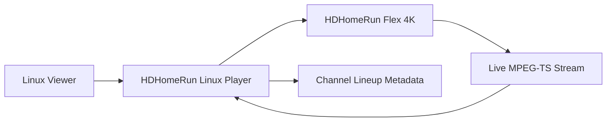

# Business Overview

## Business Context Diagram

## Text Alternative

- Linux viewer uses a Linux player application.
- The player queries the HDHomeRun device for channel metadata.
- The player requests a live MPEG-TS stream from the device.
- The player decodes and presents live TV to the viewer.

## Business Description
- **Business Description**: This workspace contains SiliconDust building blocks for discovering HDHomeRun devices, controlling tuners, scanning channels, and transporting live television streams over the network.
- **Business Goal for This Project**: Create a Linux-friendly live TV experience for an HDHomeRun Flex 4K owner by adding the missing playback and user-interface layer.

## Business Transactions
- **Discover Device**: Find one or more HDHomeRun tuners on the local network.
- **Inspect Device State**: Read tuner state, channel lineup, signal status, and supported features.
- **Choose Channel**: Select a channel from the device lineup or by explicit tuner/channel controls.
- **Allocate Tuner and Stream**: Request a live stream URL or a tuner session and begin receiving MPEG-TS video.
- **Play Live TV**: Decode and render live audio/video with live-stream buffering behavior.
- **Optional Record or Save**: Persist the incoming MPEG-TS stream to disk.

## Business Dictionary
- **HDHomeRun**: A network-attached TV tuner device made by SiliconDust.
- **Tuner**: One hardware stream slot on the device that can tune a channel.
- **Lineup**: The list of channels/programs exposed by the device over HTTP.
- **MPEG-TS**: The transport-stream format delivered for live TV playback.
- **Channel Scan**: Device-side detection of tunable channels and programs.

## Component Level Business Descriptions

### documentation
- **Purpose**: Provides the documentation entry point and links to SiliconDust developer references.
- **Responsibilities**: Point developers at the canonical documentation source.

### libhdhomerun
- **Purpose**: Implements the device control and streaming protocol used by HDHomeRun tuners.
- **Responsibilities**: Discover devices, read tuner state, change tuner settings, scan channels, and receive raw transport-stream data.

### sdnet
- **Purpose**: Supplies broad network, OS abstraction, crypto, and web infrastructure utilities.
- **Responsibilities**: Cross-platform support for networking, threading, files, crypto, web serving, and embedded service helpers.

### hdhomerun-linux
- **Purpose**: Serves as the target repository for the Linux-specific player project and AI-DLC artifacts.
- **Responsibilities**: Host planning artifacts now and the Linux player implementation later.