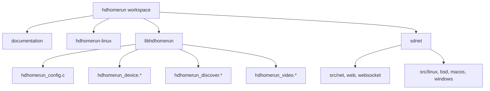

# Code Structure

## Build System
- **Primary Build Type**: GNU Make
- **Key Build Files**:
  - `/home/felix/src/hdhomerun/libhdhomerun/Makefile`
  - `/home/felix/src/hdhomerun/sdnet/tools/webserver_page_gen/Makefile`
  - `/home/felix/src/hdhomerun/sdnet/tools/rom_gen/Makefile`
- **Observed Project Shape**: Multi-package vendor source tree with a minimal host repository for new work.

## Module Hierarchy

## Text Alternative

- The workspace root splits into documentation, host repo, `libhdhomerun`, and `sdnet`.
- `libhdhomerun` contains both the reusable library and the `hdhomerun_config` CLI.
- `sdnet` contains reusable systems and network building blocks organized by subsystem and platform.

## Existing Files Inventory

### Highest-Value Reuse Candidates
- `/home/felix/src/hdhomerun/libhdhomerun/hdhomerun.h` - Public umbrella header for the vendor library.
- `/home/felix/src/hdhomerun/libhdhomerun/hdhomerun_device.h` - Device lifecycle, tuner control, status, and streaming API.
- `/home/felix/src/hdhomerun/libhdhomerun/hdhomerun_device.c` - Implementation of device, tuner, and stream operations.
- `/home/felix/src/hdhomerun/libhdhomerun/hdhomerun_discover.h` - Device discovery API.
- `/home/felix/src/hdhomerun/libhdhomerun/hdhomerun_discover.c` - Discovery implementation.
- `/home/felix/src/hdhomerun/libhdhomerun/hdhomerun_video.h` - Video socket and stream buffer API.
- `/home/felix/src/hdhomerun/libhdhomerun/hdhomerun_video.c` - Stream buffering implementation.
- `/home/felix/src/hdhomerun/libhdhomerun/hdhomerun_channels.h` - Channel map helper API.
- `/home/felix/src/hdhomerun/libhdhomerun/hdhomerun_channelscan.h` - Channel scan API.
- `/home/felix/src/hdhomerun/libhdhomerun/hdhomerun_config.c` - Existing CLI entry point for discovery, control, scanning, and stream saving.

### Support and Platform Files
- `/home/felix/src/hdhomerun/libhdhomerun/hdhomerun_sock.c` - Socket abstraction entry points.
- `/home/felix/src/hdhomerun/libhdhomerun/hdhomerun_sock_posix.c` - POSIX socket support.
- `/home/felix/src/hdhomerun/libhdhomerun/hdhomerun_sock_netlink.c` - Linux interface detection.
- `/home/felix/src/hdhomerun/libhdhomerun/hdhomerun_os_posix.c` - POSIX OS helpers.
- `/home/felix/src/hdhomerun/libhdhomerun/hdhomerun_control.c` - Low-level control protocol implementation.

### sdnet Areas Potentially Reusable Later
- `/home/felix/src/hdhomerun/sdnet/src/web/` - Embedded web-server-related utilities.
- `/home/felix/src/hdhomerun/sdnet/src/webclient/` - Client-side web utility modules.
- `/home/felix/src/hdhomerun/sdnet/src/upnp/` - UPnP-related support.
- `/home/felix/src/hdhomerun/sdnet/src/thread/` - Threading primitives.
- `/home/felix/src/hdhomerun/sdnet/src/net/` - Lower-level networking helpers.

### Missing Player Files
- No Linux UI application files exist yet.
- No decoder, playback engine, playlist UI, or EPG files exist yet.
- No `package.json`, `pyproject.toml`, or `Cargo.toml` exists in `hdhomerun-linux`.

## Design Patterns

### Platform Abstraction
- **Location**: `hdhomerun_os_*`, `hdhomerun_sock_*`, and `sdnet/src/*/{linux,bsd,macos,windows}`.
- **Purpose**: Separate shared logic from OS-specific implementations.
- **Implementation**: Shared headers paired with platform-specific source files.

### Thin CLI on Top of Library
- **Location**: `hdhomerun_config.c` over the `libhdhomerun` sources.
- **Purpose**: Expose core device operations without embedding UI logic into the library.
- **Implementation**: CLI parses commands and delegates to library functions.

## Critical Dependencies

### pthread
- **Usage**: Linked by `libhdhomerun/Makefile` for Linux and other POSIX platforms.
- **Purpose**: Threaded synchronization and runtime support.

### librt
- **Usage**: Added on Linux by `libhdhomerun/Makefile`.
- **Purpose**: Linux runtime support for timing-related functionality.

## Structural Conclusion

The codebase already has a strong separation between device protocol logic and higher-level applications. The cleanest way to add a Linux player is to build a new application in `hdhomerun-linux` and treat `libhdhomerun` as a vendor dependency or reference implementation rather than modifying the vendor tree aggressively.