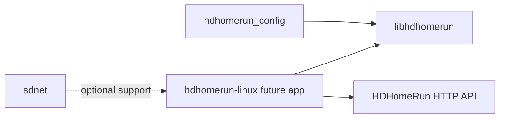

# Dependencies

## Internal Dependencies

## Text Alternative

- `hdhomerun_config` depends on `libhdhomerun`.
- The future Linux app is expected to depend on `libhdhomerun` and the HDHomeRun HTTP API.
- `sdnet` is optional support infrastructure, not a mandatory direct dependency for the first player iteration.

### hdhomerun_config depends on libhdhomerun
- **Type**: Compile-time and runtime
- **Reason**: The CLI directly delegates device operations to vendor library functions.

### Future Linux Player depends on libhdhomerun concepts or bindings
- **Type**: Likely runtime and build-time
- **Reason**: Discovery, tuner control, and status handling are already implemented there.

### Future Linux Player depends on HDHomeRun HTTP API
- **Type**: Runtime network dependency
- **Reason**: Channel lineup and direct stream URLs are exposed over HTTP.

## External Dependencies

### pthread
- **Purpose**: Threading support in the vendor build.
- **License**: System library.

### librt
- **Purpose**: Linux runtime support required by the vendor Makefile.
- **License**: System library.

### HDHomeRun Device on Local Network
- **Purpose**: Required hardware integration target for discovery, control, and playback.
- **License**: External hardware dependency.

## Dependency Conclusion

The dependency graph is favorable for a new Linux player because the workspace already isolates device logic into a reusable boundary. The missing dependency is not another SiliconDust library; it is a playback engine and UI stack.